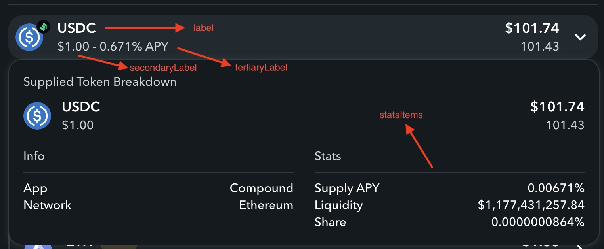

# App Tokens

## What is an `AppToken`?

The `AppToken` object is an investment positions that are represented by a token standard like `ERC20`. These are transferrable and fungible positions that maybe considered as a _receipt_ for an investment transaction with a Web3 app. These _receipts_ may be used to represent:

- Liquidity pool positions in a decentralized exchange like **Uniswap**, **SushiSwap**, or **Curve**
- Autocompounding "vaults" like in a yield aggregator like **Pickle** or **Yearn**
- Supply and borrow positions in a lending app like **Aave**
- Or even more obscure primitives like options in **Opyn** or prize savings accounts in **PoolTogether**

## What is a `TokenFetcher`?

In the Zapper API, a `TokenFetcher` class dynamically lists a single group of `AppToken` typed objects. Groups of tokens share common properties, such as APYs for **Pickle** vault tokens, or fees for **Uniswap** pool tokens. As such, we declare unique strategy classes for each token group that we want to index in Zapper.

## What are the properties of an app token?

The following table describes the properties on the `AppToken` object.

| Property        | Example                                        | Description                                                                                                                                                                          |
| --------------- | ---------------------------------------------- | ------------------------------------------------------------------------------------------------------------------------------------------------------------------------------------ |
| `type`          | `ContractType.APP_TOKEN`                       | Used to [discriminate types](https://css-tricks.com/typescript-discriminated-unions/), do not change.                                                                                |
| `address`       | `'0x028171bca77440897b824ca71d1c56cac55b68a3'` | Address of the token                                                                                                                                                                 |
| `network`       | `Network.ETHEREUM`                             | Network of the token                                                                                                                                                                 |
| `key`           | See below                                      | Optional. A unique key that represents this token, used for aggregation purposes in Zapper.                                                                                          |
| `appId`         | `'aave-v2'`                                    | The token belongs to this app                                                                                                                                                        |
| `groupId`       | `'supply'`                                     | The token belongs to this app group.                                                                                                                                                 |
| `symbol`        | `'aDAI'`                                       | The ERC20 symbol of this token                                                                                                                                                       |
| `decimals`      | `18`                                           | The ERC20 decimals of this token                                                                                                                                                     |
| `supply`        | `438584072.834534305205134424`                 | The display value of the ERC20 supply of this token                                                                                                                                  |
| `tokens`        | `[daiToken]`                                   | The underlying token(s). For example, to mint `aDAI` tokens, you need to supply `DAI` tokens.                                                                                        |
| `price`         | `1`                                            | The price of one unit of this token. In the case of `aDAI`, the tokens are minted 1:1, so the price is the same as the underlying `DAI` token.                                       |
| `pricePerShare` | `1`                                            | The _ratio_ between the price of the token and the price of the underlying token. Since `aDAI` and `DAI` are minted 1:1, the `pricePerShare` is 1.                                   |
| `dataProps`     | See below.                                     | Additional data props that might be useful to be passed in other areas of the application. For example, the `liquidity` data prop is used by Zapper to calculate the protocol's TVL. |
| `displayProps`  | See below.                                     | Properties used by Zapper Web and Zapper Mobile to render meaningful information to Zapper users.                                                                                    |

## What are data props?

The `dataProps` field on an `AppTokenPosition` object is used for augmenting the token object with additional data properties. These properties can be used in other places in the application.

_Example_: In **Aave V2**, the supply tokens like `aDAI` and `aUSDC` are "receipt" tokens for deposits. We can augment the `dataProps` with a `liquidity` property that represents the total amount in USD for that given deposit token. Another part of the Zapper API aggregates the `liquidity` data property to calculate the total TVL of **Aave V2**.

## What are display props?

The `displayProps` field on an `AppTokenPosition` object is used by Zapper Web and Zapper Mobile to render meaningful information to Zapper users about this token.

| Property         | Example      | Description                                                                                                                                                                                                                                                           |
| ---------------- | ------------ | --------------------------------------------------------------------------------------------------------------------------------------------------------------------------------------------------------------------------------------------------------------------- |
| `label`          | `cUSDC`      | The primary label for this token. Token symbols generally aren't very human readable, so optimize for understanability.                                                                                                                                               |
| `secondaryLabel` | `$1.00`      | The secondary label for this token. Often, its useful to put the token price here. Use your best judgement here; for example, Uniswap V2 token prices are not very human readable, so its instead useful to put the reserve percentages here instead for those cases. |
| `tertiaryLabel`  | `0.671% APY` | The tertiary label for this token. Most of the time, you don't need to use this field, but it could be useful to surface additional information to the user like an APY for a vault or lending token.                                                                 |
| `statsItems`     | `[]`         | An array of `StatsItem` objects that is rendered when expanding more details for the token. This field can include any additional information that is useful for the user in an expanded view.                                                                        |

## FAQ

### What is `pricePerShare`? Why is it useful?

The `pricePerShare` field is the ratio between the token price and the prices of the underlying tokens. This property is useful for using the balance of the token to determine the _exposure_ to the underlying tokens.

_Example 1_: In the case of **Aave V2** supply tokens like `aDAI`, these are minted 1:1 with the deposited token, `DAI`. As such, the `price` of `aDAI` is the same as the price of `DAI` (about $1 USD), and so the `pricePerShare` is also 1.

_Example 2_: In the case of **Yearn** vault tokens like `yDAI`, Yearn strategies yield gains by accumulating more of the underlying vault token. The `pricePerShare` increases over time as the strategies successfully farm yield. At the time of writing, the `pricePerShare` for `yDAI` is about `1.12`.

_Example 3_: In the case of **Uniswap V2** pool tokens, the `pricePerShare` will be an _array of ratios_, representing how much of each of the underlying token corresponds to each pool token. We can use the pool reserves and the pool token supply to calculate this as `[reserve0 / supply, reserve1 / supply]`.

### What is `key`? Why is it useful?

The `key` is a unique identifier on the token object that is used to aggregate token balances across multiple addresses.

Usually, you can ignore setting the `key` and Zapper API will set the default as `md5(<app_id>:<network>:<address>)`. However, in some circumstances, this is _not_ a unique identifier, in which case, you can override the `key` property in your token fetcher.

_Example 1_: In **Lyra**, the protocol uses an ERC1155 contract for tokens representing call and put options. The ERC1155 standard allows multiple token fungible tokens through a single contract address. In this case, each option token has an `id` field as an identifier, so we can use this in the key as `md5(<app_id>:<network>:<address>:<id>)`.
