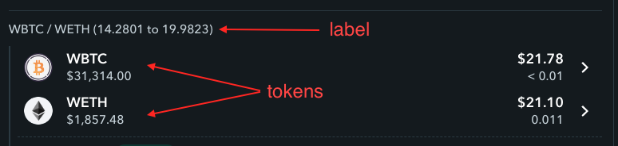

# App Tokens

## What is a `ContractPosition`?

A `ContractPosition` object represents a position that is _not_ represented by a token standard. It is often these positions that are more difficult to track by simple wallet applications, and this is especially where Zapper shines at decoding these positions from blockchain data. These positions may be used to represent:

- Farming positions in **SushiSwap** Master Chef staking contracts
- Bonds in **Olympus** or other apps that aim to own their liquidity
- Leveraged positions like **Abracadabra** cauldrons or **Alchemix** alchemists
- Lending positions in **Compound** (Note: _Supply_ positions are represented by tokens!)
- Claimable airdrops across the Web3 ecosystem!

As a rule of thumb, you can identify `ContractPosition` as one you _can not_ add to your Metamask wallet because they are _not_ tokenized! For example, once you deposit a token into a SushiSwap Master Chef farm, your wallet will likely not be able to display this position.

## What is a `ContractPositionFetcher`?

In the Zapper API, a `ContractPositionFetcher` class dynamically lists a single group of contract positions. Groups of contract positions share common properties, such as APYs for **SushiSwap** farms, or collateralization limits for **Alchemix** alchemists. As such, we declare unique strategy classes for each contract position group that we want to index in Zapper.

## What are the properties of a contract position?

The following table describes the properties on the `ContractPosition` object. You'll see there is quite a bit of overlap with an `AppToken`, except a `ContractPosition` lacks the ERC20 properties, and cannot be priced because its non-fungible.

| Property       | Example                                        | Description                                                                                                 |
| -------------- | ---------------------------------------------- | ----------------------------------------------------------------------------------------------------------- |
| `type`         | `ContractType.POSITION`                        | Used to [discriminate types](https://css-tricks.com/typescript-discriminated-unions/), do not change.       |
| `address`      | `'0xa39739ef8b0231dbfa0dcda07d7e29faabcf4bb2'` | Address of the contract. Use the address that a user interacts with to enter this position.                 |
| `network`      | `Network.ETHEREUM`                             | Network of the contract.                                                                                    |
| `key`          | See below.                                     | Optional. A unique key that represents this contract position, used for aggregation purposes in Zapper.     |
| `appId`        | `'liquity'`                                    | The contract position belongs to this app                                                                   |
| `groupId`      | `'trove'`                                      | The contract position belongs to this app group                                                             |
| `tokens`       | `[supplied(ethToken), borrowed(lusdToken)]`    | The underlying token(s). For example, in a Liquity trove, the user deposits ETH as collateral to mint LUSD. |
| `dataProps`    | See below.                                     | Additional data props that might be useful to be passed in other areas of the application.                  |
| `displayProps` | See below.                                     | Properties used by Zapper Web and Zapper Mobile to render meaningful information to Zapper users.           |

## What are data props?

The `dataProps` field on a `ContractPosition` object is used for augmenting the contract position object with additional data properties. These properties can be used in other places in the application.

_Example_: In **Maker**, a user can open a vault by depositing collateral like `ETH` or `WBTC`. The user can then mint `DAI` up to some collateralization ratio. This collateralization ratio can be added to the `ContractPosition` `dataProps`.

## What are display props?

The `displayProps` field on an `ContractPosition` object is used by Zapper Web and Zapper Mobile to render meaningful information to Zapper users about this contract position.

> **_NOTE:_**  We do intend to support the `secondaryLabel`, `tertiaryLabel`, and `statsItems` props eventually, but for now, we only show the `label` field on Zapper Web and Zapper Mobile.

| Property         | Example                       | Description                                                                                                                                                                                                                                                           |
| ---------------- | ----------------------------- | --------------------------------------------------------------------------------------------------------------------------------------------------------------------------------------------------------------------------------------------------------------------- |
| `label`          | `WBTC / ETH (14.28 to 19.98)` | The primary label for this contract position. In the **Uniswap V3** example, its useful to show the underlying tokens and the liquidity concentration range.                                                                                                          |

## FAQ

### What `address` should I use for a `ContractPosition`?

The `address` field should be the address of the contract that a user can use to _enter the position_. Zapper API can cross-reference a user's transactions to these addresses to determine if a user has ever interacted with this app.

_Example 1_: In **SushiSwap**, the pool tokens are deposited into a farm contract called `MasterChefV2`, but bonus rewards are claimable from separate `Rewarder` contracts. Since the user deposits funds by interacting with the `MasterChefV2` contract, you'll use this address in the `address` field. It may be useful to add the `Rewarder` address to the contract position's `dataProps` field.

_Example 2_: In **Yield Protocol**, a vault is opened by interacting with the `Ladle` contract, but funds are stored in the `Cauldron` contract. It may be tempting to use the `Cauldron` address in this case, but use the `Ladle` address since this is the entrypoint of user's funds into the protocol.

### What is `key`? Why is it useful?

Similarly to the `key` property `AppToken`, the `key` is a unique identifier on the position object that is used to aggregate contract position balances across multiple addresses.

Usually, you can ignore setting the `key` and Zapper API will set the default as `md5(<app_id>:<network>:<address>:<tokens_keys>)`, where `tokens_keys` is itself `<app_id>:<network>:<address>:<metatype>` for each token in the contract position's `tokens` array. However, in some circumstances, this is _not_ a unique identifier, in which case, you can override the `key` property in your contract position fetcher.

_Example 1_: In **FloorDAO**, a user can sell fractional NFT tokens to the protocol treasury in return for a `FLOOR` token bond, which vests over a period of time. The bonds are all on the same address, and have the same underlying tokens: vesting and claimable `FLOOR`. However, if a bundle of addresses included one address with a bond that was opened by selling `PUNK` and another address with a bond that was opened by selling `MILADY`, these would be aggregated into a _single balance_ because of the key collision! Instead, we'll note that each bond has a `marketIndex`, and produce the key as simply `md5(<app_id>:<network>:<address>:<market_index>)` to prevent collisions.
