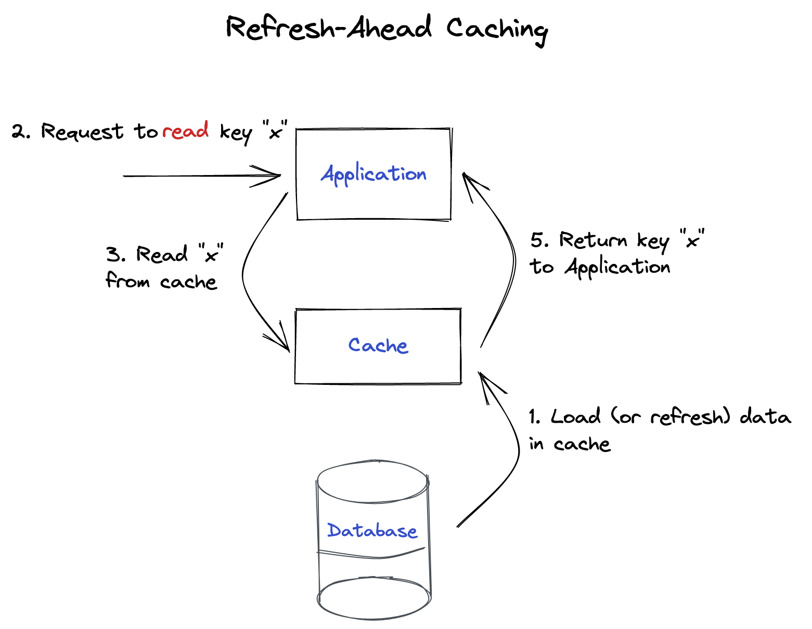

# Caching Patterns

## Read-through caching for user-centric data

_Coming soon!_

## Refresh-ahead caching for user-agnostic data

Often times, you'll find yourself requesting API data in your app integration
code. This data is usually required for all users requesting balances for your
app. As such, we call this data _user-agnostic_.

However, third-party APIs may have outages that can break your API integration.
Furthermore, the production traffic in Zapper is usually high enough to bring
down APIs hosted on cheap infrastructure.

You can use the `@CacheOnInterval` decorator to annotate a method that makes a
call to an API endpoint.

1. The decorator will spawn a background job that will periodically call the
   method and cache the result
2. Any calls to the method will retrieve the result from cache directly

> **NOTE**: This pattern is known as **refresh-ahead caching**, and resolves the
> [thundering herd problem](https://en.wikipedia.org/wiki/Thundering_herd_problem)
> for caching. Stay tuned in the future for a recipe on **read-through cache**.



Let's see how this can be used in practice. We'll look at **Badger** vault
tokens for this example, and we'll use the Badger API to retrieve all active
vaults.

```ts
// ...
import { CacheOnInterval } from "~cache/cache-on-interval.decorator";
// ...

// ...
export class EthereumBadgerVaultTokenFetcher
  implements PositionFetcher<AppTokenPosition>
{
  // ...
  @CacheOnInterval({
    key: `apps-v3:${network}:${appId}:${groupId}:definitions`,
    timeout: 15 * 60 * 1000,
  })
  async getVaultDefinitions() {
    const { data } = await Axios.get<BadgerApiTokensResponse>(
      "https://api.badger.com/v2/tokens?chain=ethereum"
    );
    const vaultDefinitions = values(data)
      .filter((t) => t.type === "Vault")
      .map((t) => ({
        address: t.address.toLowerCase(),
        underlyingAddress: t.vaultToken.address.toLowerCase(),
      }));
    return vaultDefinitions;
  }

  async getPositions() {
    const vaultDefinitions = await this.getVaultDefinitions();

    // ...use the vault definitions to build the tokens
  }
}
```

In this example, the API is only called once ever **15 minutes**. The response
is filtered and transformed, then persisted in the cache. In production, the
`getPositions` method is called every **45 seconds**. When it makes a call to
`getVaultDefinitions`, it retrieves the last cached value.
