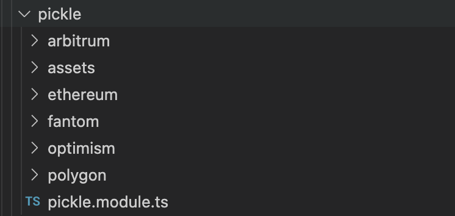

# Update your app definition

In this section, we'll inspect and build upon the generated **App Definition**.

## Inspect the generated code

After following the previous section, you should now have a skeleton folder structure for our **Pickle Finance** application integration.



The app definition file created in `src/apps/pickle/pickle.definition.ts` will be our starting point. Let's have a look!

```ts
import { Register } from '~app-toolkit/decorators';
import { AppDefinition } from '~app/app.definition';
import { ProtocolAction } from '~app/app.interface';
import { Network } from '~types/network.interface';

export const PICKLE_DEFINITION = {
  id: 'pickle',
  name: 'Pickle Finance',
  description:
    'Pickle Finance helps users to maximize their DeFi yields by auto-compounding their rewards, saving them time and gas.',
  url: 'https://pickle.finance/',
  groups: {},
  tags: [],
  supportedNetworks: {
    [Network.ETHEREUM_MAINNET]: [ProtocolAction.VIEW],
    [Network.POLYGON_MAINNET]: [ProtocolAction.VIEW],
    [Network.ARBITRUM_MAINNET]: [ProtocolAction.VIEW],
  },
  primaryColor: '#fff',
};

@Register.AppDefinition(PICKLE_DEFINITION.id)
export class PickleAppDefinition extends AppDefinition {
  constructor() {
    super(PICKLE_DEFINITION);
  }
}

export default PICKLE_DEFINITION;
```

The prompts in the previous step have filled in most of the details of our application, including the ID, name, description, and URL. We see that the networks that we intend to support have also been populated.

You'll notice that a class has been declared called `PickleAppDefinition`, and it has been _decorated_ with `@Register.AppDefinition`. This annotation _registers_ this the Pickle app definition as a [provider](https://docs.nestjs.com/providers) in our NestJS app so it can be discovered by the rest of the application.

## What are groups?

In Zapper, we define a **group** as a _discrete type of investment opportunity_. We distinguish two types of groups: **tokenized** groups and **non-tokenized** groups. Elements of a tokenized group are simply referred to as **Tokens**, and elements of a non-tokenized group are referred to as **Contract Positions**. Let's take a look at a few examples!

### Tokens

Tokens are investment positions that are represented by a token standard like `ERC20`. These are transferrable and fungible positions that maybe considered as a _receipt_ for an investment transaction. These _receipts_ may be used to represent:

- Liquidity pool positions in a decentralized exchange like **Uniswap**, **SushiSwap**, or **Curve**
- Autocompounding "vaults" like in a yield aggregator like **Pickle** or **Yearn**
- Supply and borrow positions in a lending app like **Aave**
- Or even more obscure primitives like options in **Opyn** or prize savings accounts in **PoolTogether**

### Contract Positions

Contract Positions are investment positions that are _not_ represented by a token standard. It is often these positions that are more difficult to track by simple wallet applications, and this is especially where Zapper shines, decoding these positions from blockchain data and showing it to the user in a straightforward manner in their portfolio. These positions may be used to represent:

- Farming pool token positions in **SushiSwap** Master Chef staking contracts
- Bonds in **Olympus** or other apps that aim to own their liquidity
- Leveraged positions in isolated markets like **Abracadabra** cauldrons or **Alchemix** alchemists
- Claimable airdrops across the Web3 ecosystem!

As a little rule of thumb, you likely won't be able to manually add these positions to your Metamask wallet because they are _not_ tokenized! For example, once you deposit a token into a SushiSwap Master Chef farm, your wallet will likely not be able to display this position.

## Add groups to your app

In this guide, we will integrate Pickle **Jars** and **Farms**.

Jar deposits are represented by an ERC20 token that _wraps_ the underlying token being deposited. Farms, however, are _not_ represented by a token. Let's import the `GroupType` object and update the `groups` entry in our app definition to express these positions.

Additionally, let's add a label to these groups.

```ts
// Import the GroupType in order to leverage it in our definition
import { GroupType } from '~app/app.interface';

//...
export const PICKLE_DEFINITION = {
  // ...
  groups: {
    jar: { id: 'jar', type: GroupType.TOKEN, label: 'Jars' },
    farm: { id: 'farm', type: GroupType.POSITION, label: 'Farms' },
  },
  // ...
};
```

(NB: In reality, Pickle has a few more group types. Don't be alarmed! Apps evolve over time and we'll need to update their integrations as they do so)

Voila! Our definition file is now more complete, and we can start defining our position fetchers.