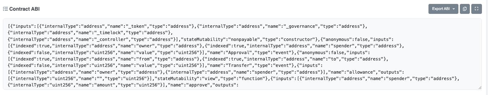
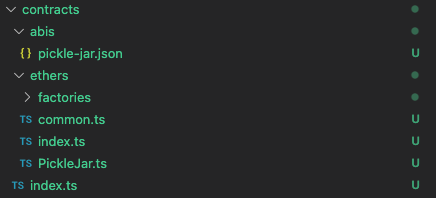

# Generate a contract factory

## What is a contract factory?

In the Zapper API, a `ContractFactory` class is a convenience helper class that instantiates typed [Ethers.js](https://docs.ethers.io/) contract instances. These contracts require having the [ABI](https://www.quicknode.com/guides/solidity/what-is-an-abi) defined in your app subdirectory. We use [TypeChain](https://github.com/dethcrypto/TypeChain) to automatically generate types for these ABIs to simplify the developer experience of interacting with smart contracts.

## Add an ABI to your app

For the **Pickle Finnace** app, we'll need the ABI for the **Jar** tokens that we intend to enumerate in our application. An easy way to find this ABI is to open [any Pickle vault token on Etherscan](https://etherscan.io/address/0x1bb74b5ddc1f4fc91d6f9e7906cf68bc93538e33), click the **Contract** tab, scroll down, and copy the JSON from the **Contract ABI** section.

Once copied, we'll save the JSON in `src/pickle/contracts/abi/pickle-jar.json`.

## Generate the contract factory class

In your terminal, run `yarn studio generate:contract-factory pickle`. This command will generate TypeChain interfaces for all contract ABIs you have in the `src/pickle/contracts/abi` directory, and generate our injectable `PickleContractFactory` convenience class in `src/pickle/contracts/index.ts`.

We're done here! In the next section, we'll use this contract to list out Pickle jar tokens in our application.