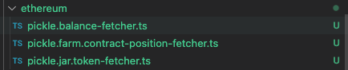

# Create a token fetcher

## What is a token?

As mentioned in the previous section, **Tokens** are investment positions that are represented by a token standard like `ERC20`. These are transferrable and fungible positions that maybe considered as a _receipt_ for an investment transaction. These _receipts_ may be used to represent:

- Liquidity pool positions in a decentralized exchange like **Uniswap**, **SushiSwap**, or **Curve**
- Autocompounding "vaults" like in a yield aggregator like **Pickle** or **Yearn**
- Supply and borrow positions in a lending app like **Aave**
- Or even more obscure primitives like options in **Opyn** or lottery tickets in **PoolTogether**

## What is a token fetcher?

In the Zapper API, a `TokenFetcher` class dynamically lists a single group of tokens. Groups of tokens share common properties, such as APYs for **Pickle** vault tokens, or fees for **Uniswap** pool tokens. As such, we declare unique strategy classes for each token group that we want to index in Zapper.

## Generate boilerplate for your app

Our codegen utilities will automatically generate the boilerplate for these fetchers. Once your `groups` in your definition file have been configured correctly (see the previous lessons in this tutorial), run `pnpm studio codegen-app pickle`.



You'll notice that in each of your supported networks, the codegen utility has generated a jar token fetcher, a farm contract position fetcher, and a balance fetcher. We'll go into these individual files over the course of this tutorial.

## Implement the token fetcher

Let's open `src/apps/pickle/ethereum/pickle.jar.token-fetcher.ts`. The skeleton has been assembled for you, and you'll now need to fill in the contents of the `getPositions` method in the `EthereumPickleJarTokenFetcher`.

```ts
import { Inject } from '@nestjs/common';

import { IAppToolkit, APP_TOOLKIT } from '~app-toolkit/app-toolkit.interface';
import { Register } from '~app-toolkit/decorators';
import { PositionFetcher } from '~position/position-fetcher.interface';
import { AppTokenPosition } from '~position/position.interface';
import { Network } from '~types/network.interface';

import { PickleContractFactory } from '../contracts';
import { PICKLE_DEFINITION } from '../pickle.definition';

const appId = PICKLE_DEFINITION.id;
const groupId = PICKLE_DEFINITION.groups.jar.id;
const network = Network.ETHEREUM_MAINNET;

@Register.TokenPositionFetcher({ appId, groupId, network })
export class EthereumPickleJarTokenFetcher implements PositionFetcher<AppTokenPosition> {
  constructor(
    @Inject(APP_TOOLKIT) private readonly appToolkit: IAppToolkit,
    @Inject(PickleContractFactory) private readonly pickleContractFactory: PickleContractFactory,
  ) {}

  async getPositions() {
    return [];
  }
}
```

You'll notice that the `AppToolkit` and `PickleContractFactory` have already been injected into the scope of your class. What are these? The `AppToolkit` provides an SDK of utilities to interact with the blockchain, retrieve base token prices, or even retrieve tokens and positions from other apps defined in Zapper. The `PickleContractFactory`, as explained in the previous section, builds typed instances of the contract ABIs you have in your `src/pickle/contracts/abis` directory.

Let's get to work!

## Resolve all Jar token addresses from the Pickle API

Pickle provides an [API endpoint](https://api.pickle.finance/prod/protocol/pools) that lists out all of the jar tokens across all supported networks on the Pickle application.

We'll make use of this endpoint to list out all of our tokens.

```ts
// ...

// Define a partial of the return type from the Pickle API
export type PickleVaultDetails = {
  jarAddress: string;
  network: string;
  apy: number;
};

@Register.TokenPositionFetcher({ appId, groupId, network })
export class EthereumPickleJarTokenFetcher implements PositionFetcher<AppTokenPosition> {
  constructor(
    @Inject(APP_TOOLKIT) private readonly appToolkit: IAppToolkit,
    @Inject(PickleContractFactory) private readonly pickleContractFactory: PickleContractFactory,
  ) {}

  async getPositions() {
    // Retrieve pool addresses from the Pickle API
    const endpoint = 'https://api.pickle.finance/prod/protocol/pools';
    const data = await Axios.get<PickleVaultDetails[]>(endpoint).then(v => v.data);
    const ethData = data.filter(({ network }) => network === 'eth');
    const jarAddresses = ethData.map(({ jarAddress }) => v.jarAddress.toLowerCase());
    const jarAddressToDetails = _.keyBy(ethData, v => v.jarAddress.toLowerCase());

    // Return _anything_ so we can see a result right now!
    return jarAddresses as any;
  }
}
```

Easy enough. Let's wire things together and we'll see what happens!

## Run the application

We can now run our **Pickle** application integration and start manually testing some of our data. We also do _not_ want to run all of the other apps defined in Studio. Create a `.env` file at the root, and update it as follows:

```dosini
ENABLED_APPS=pickle
```

Now, we can run the Studio development server in the terminal with `pnpm dev`. If it started successfully, you can now open `http://localhost:5001/apps/pickle/tokens?groupIds[]=jar&network=ethereum` in your browser. You should see a list of addresses returned, and if you open any of these addresses in Etherscan, you'll see that they're all Pickle jar tokens. Hooray 🎉!

## Resolve standard ERC20 token properties

Firstly, you may have noticed the return statement being typecast to `any` in our current `getPositions` function body. A `TokenFetcher` class is actually expected to return a list of `AppTokenPosition` objects.

Let's start by retrieving standard ERC20 properties for each jar token: `symbol`, `decimals`, and `supply`. We'll be making requests using a typed Ethers contract instance from our `ContractFactory` to request on-chain data. We'll also optimize this by using a Multicall wrapper utility to batch contract calls into a single request.

```ts
// ...

@Register.TokenPositionFetcher({ appId, groupId, network })
export class EthereumPickleJarTokenFetcher implements PositionFetcher<AppTokenPosition> {
  constructor(
    @Inject(APP_TOOLKIT) private readonly appToolkit: IAppToolkit,
    @Inject(PickleContractFactory) private readonly pickleContractFactory: PickleContractFactory,
  ) {}

  async getPositions() {
    // ...

    // Create a multicall wrapper instance to batch chain RPC calls together
    const multicall = this.appToolkit.getMulticall(network);
    
    // We will build a token object for each jar address, using data retrieved on-chain with Ethers
    const tokens = await Promise.all(
      jarAddresses.map(async jarAddress => {
        // Instantiate a smart contract instance pointing to the jar token address
        const contract = this.pickleContractFactory.pickleJar({ address: jarAddress, network });

        // Request the symbol, decimals, ands supply for the jar token
        const [symbol, decimals, supplyRaw] = await Promise.all([
          multicall.wrap(contract).symbol(),
          multicall.wrap(contract).decimals(),
          multicall.wrap(contract).totalSupply(),
        ]);

        // Denormalize the supply
        const supply = Number(supplyRaw) / 10 ** decimals;

        // Create the token object
        const token: AppTokenPosition = {
          type: ContractType.APP_TOKEN,
          appId,
          groupId,
          address: jarAddress,
          network,
          symbol,
          decimals,
          supply,
        };

        return token;
      }),
    );

    return tokens;
  }
}
```

## Resolve the underlying token and ratio

In Web3, composability is king. Tokens wrap other tokens with functionality that provides value to the owner. You may have heard the term **DeFi Legos** for this reason.

In the case of **Pickle Finance**, a user deposits a token, and receives a vault token that represents an auto-compounding balance of the deposited token. The yield is aggregated from some underlying strategy and returned to the user.

Our `AppTokenPosition` object represents this relationship using the `tokens` and `pricePerShare` properties. The `tokens` property is an array of the underlying tokens of the wrapper token, and the `pricePerShare` property represents the ratio between the balance of the app token and the balance of the underlying token.

For example, if a user deposits 1100 `LOOKS` tokens into a Pickle vault that has a `pricePerShare` of `1.1`, the user receives 1000 `pLOOKS` tokens as a receipt. Conversely, on withdrawal, they would receive 1100 `LOOKS` tokens for burning their 1000 `pLOOKS` tokens.

Let's see how to retrieve this data for a Pickle jar token:

```ts
// ...

@Register.TokenPositionFetcher({ appId, groupId, network })
export class EthereumPickleJarTokenFetcher implements PositionFetcher<AppTokenPosition> {
  constructor(
    @Inject(APP_TOOLKIT) private readonly appToolkit: IAppToolkit,
    @Inject(PickleContractFactory) private readonly pickleContractFactory: PickleContractFactory,
  ) {}

  async getPositions() {
    // ...

    // A user can deposit base tokens like LOOKS or LQTY
    const baseTokenDependencies = await this.appToolkit.getBaseTokenPrices(network);

    // ...or a user can deposit other app tokens like Uniswap or Curve LP tokens
    const appTokenDependencies = await this.appToolkit.getAppTokenPositions(
      { appId: 'uniswap-v2', groupIds: ['pool'], network },
      { appId: 'curve', groupIds: ['pool'], network },
    );

    const allTokenDependencies = [...appTokenDepencies, ...baseTokenDependencies];
   
    const tokens = await Promise.all(
      jarAddresses.map(async jarAddress => {
        // ...

        // Request the underlying token address and ratio for the jar token
        const [underlyingTokenAddressRaw, ratioRaw] = await Promise.all([
          multicall
            .wrap(contract)
            .token()
            .catch(() => ''),
          multicall
            .wrap(contract)
            .getRatio()
            .catch(() => ''),
        ]);

        // Find the underlying token in our dependencies.
        // Note: If it is not found, then we have not indexed the underlying token, and we cannot 
        // index the jar token since its price depends on the underlying token price.
        const underlyingTokenAddress = underlyingTokenAddressRaw.toLowerCase();
        const underlyingToken = allTokenDependencies.find(v => v.address === underlyingTokenAddress)
        if (!underlyingToken) return null;
        const tokens = [underlyingToken]

        // Denormalize the price per share
        const pricePerShare = Number(ratioRaw) / 10 ** 18;
        const price = pricePerShare * underlyingToken.price;
        
        // Create the token object
        const token: AppTokenPosition = {
          type: ContractType.APP_TOKEN,
          appId,
          groupId,
          address: jarAddress,
          network,
          symbol,
          decimals,
          supply,
          tokens,
          price,
          pricePerShare,
        };

        return token;
      }),
    );

    // Use compact from lodash to filter out any null elements
    return _.compact(tokens);
  }
}
```

## Resolve any additional data properties

(This is an optional step and can be skipped!)

As mentioned previously, groups of tokens share common patterns on how to retrieve and build their properties, and may also share common additional properties. We can define additional properties in the `dataProps` field of the `AppTokenPosition` type.

We'll also make the use of generics to properly type our `dataProps`. The rest of our application can use these types when referencing the **Pickle** jar tokens.

Let's return the total value locked and the APY as part of the `dataProps`.

```ts
// ...

// Declare the data properties for a Pickle jar token
export type PickleJarTokenDataProps = {
  apy: number;
}

@Register.TokenPositionFetcher({ appId, groupId, network })
export class EthereumPickleJarTokenFetcher implements PositionFetcher<AppTokenPosition> {
  constructor(
    @Inject(APP_TOOLKIT) private readonly appToolkit: IAppToolkit,
    @Inject(PickleContractFactory) private readonly pickleContractFactory: PickleContractFactory,
  ) {}

  async getPositions() {
    // ...

    const tokens = await Promise.all(
      jarAddresses.map(async jarAddress => {
        // ...

        // Retrieve the APY from the map we created in the first step
        const apy = (jarAddressToDetails[jarAddress]?.apy ?? 0) / 100;

        // The TVL is the deposited reserve times the price of the deposited token
        const underlyingTokenContract = this.pickleContractFactory.pickleJar({ address: underlyingToken.address, network });
        const [reserveRaw] = await multicall.wrap(underlyingTokenContract).balanceOf(jarAddress);
        const reserve = Number(reserveRaw) / 10 ** underlyingToken.decimals; 
        const tvl = supplyreserve * underlyingToken.price;
        
        // Create the token object
        const token: AppTokenPosition<PickleJarTokenDataProps> = {
          // ...
          dataProps: {
            apy,
            tvl,
          }
        };

        return token;
      }),
    );

    return _.compact(tokens);
  }
}
```

We're almost there! Now we just need to tell Zapper how to render this token in our application.

## Resolve display properties

> What do you mean `bSupercrvRenWBTC` isn't a user-friendly name?

Using the `symbol` as a token label is generally not a great solution for human readability. Instead, we define `displayProps` on each token that instructs how Zapper will render the token in our web and mobile applications. The developer is in full control to define a `label`, `secondaryLabel`, and optional `tertiaryLabel`, and `images`.

Let's put everything together and observe our finished product!

```ts
import { Inject } from '@nestjs/common';
import Axios from 'axios';
import _, { compact } from 'lodash';

import { IAppToolkit, APP_TOOLKIT } from '~app-toolkit/app-toolkit.interface';
import { Register } from '~app-toolkit/decorators';
import { buildDollarDisplayItem } from '~app-toolkit/helpers/presentation/display-item.present';
import { getImagesFromToken, getLabelFromToken } from '~app-toolkit/helpers/presentation/image.present';
import { ContractType } from '~position/contract.interface';
import { PositionFetcher } from '~position/position-fetcher.interface';
import { AppTokenPosition } from '~position/position.interface';
import { Network } from '~types/network.interface';

import { PickleContractFactory } from '../contracts';
import { PICKLE_DEFINITION } from '../pickle.definition';

const appId = PICKLE_DEFINITION.id;
const groupId = PICKLE_DEFINITION.groups.jar.id;
const network = Network.ETHEREUM_MAINNET;

export type PickleVaultDetails = {
  jarAddress: string;
  network: string;
  apy: number;
};

export type PickleJarTokenDataProps = {
  apy: number;
};

@Register.TokenPositionFetcher({ appId, groupId, network })
export class EthereumPickleJarTokenFetcher implements PositionFetcher<AppTokenPosition> {
  constructor(
    @Inject(APP_TOOLKIT) private readonly appToolkit: IAppToolkit,
    @Inject(PickleContractFactory) private readonly pickleContractFactory: PickleContractFactory,
  ) {}

  async getPositions() {
    // Retrieve pool addresses from the Pickle API
    const endpoint = 'https://api.pickle.finance/prod/protocol/pools';
    const data = await Axios.get<PickleVaultDetails[]>(endpoint).then(v => v.data);
    const ethData = data.filter(({ network }) => network === 'eth');
    const jarAddresses = ethData.map(v => v.jarAddress.toLowerCase());
    const jarAddressToDetails = _.keyBy(ethData, v => v.jarAddress.toLowerCase());

    const baseTokens = await this.appToolkit.getBaseTokenPrices(network);
    const appTokens = await this.appToolkit.getAppTokenPositions(
      { appId: 'uniswap-v2', groupIds: ['pool'], network },
      { appId: 'curve', groupIds: ['pool'], network },
    );
    const allTokens = [...appTokens, ...baseTokens];

    // Build out the token objects
    const multicall = this.appToolkit.getMulticall(network);
    const tokens = await Promise.all(
      jarAddresses.map(async jarAddress => {
        const contract = this.pickleContractFactory.pickleJar({ address: jarAddress, network });
        const underlyingTokenContract = this.pickleContractFactory.pickleJar({ address: underlyingToken.address, network });

        const [symbol, decimals, supplyRaw, underlyingTokenAddressRaw, ratioRaw, reserveRaw] = await Promise.all([
          multicall.wrap(contract).symbol(),
          multicall.wrap(contract).decimals(),
          multicall.wrap(contract).totalSupply(),
          multicall.wrap(contract).token(),
          multicall.wrap(contract).getRatio(),
          multicall.wrap(underlyingTokenContract).balanceOf(jarAddress),
        ]);

        const supply = Number(supplyRaw) / 10 ** decimals;
        const underlyingTokenAddress = underlyingTokenAddressRaw.toLowerCase();
        const underlyingToken = allTokens.find(v => v.address === underlyingTokenAddress);
        if (!underlyingToken) return null;

        const tokens = [underlyingToken];
        const pricePerShare = Number(ratioRaw) / 10 ** 18;
        const price = pricePerShare * underlyingToken.price;
        const apy = (jarAddressToDetails[jarAddress]?.apy ?? 0) / 100;
        const reserve = Number(reserveRaw) / 10 ** underlyingToken.decimals; 
        const tvl = supplyreserve * underlyingToken.price;

        // As a label, we'll use the underlying label (i.e.: 'LOOKS' or 'UNI-V2 LOOKS / ETH'), and suffix it with 'Jar'
        const label = `${getLabelFromToken(underlyingToken)} Jar`;
        // For images, we'll use the underlying token images as well
        const images = getImagesFromToken(underlyingToken);
        // For the secondary label, we'll use the price of the jar token
        const secondaryLabel = buildDollarDisplayItem(price);
        // And for a tertiary label, we'll use the APY
        const tertiaryLabel = `${(apy * 100).toFixed(3)}% APY`;

        const token: AppTokenPosition<PickleJarTokenDataProps> = {
          type: ContractType.APP_TOKEN,
          appId,
          groupId,
          address: jarAddress,
          network,
          symbol,
          decimals,
          supply,
          tokens,
          price,
          pricePerShare,
          dataProps: {
            apy,
          },
          displayProps: {
            label,
            images,
            secondaryLabel,
            tertiaryLabel,
          },
        };

        return token;
      }),
    );

    return compact(tokens);
  }
}
```

Visit `http://localhost:5001/apps/pickle/tokens?groupIds[]=jar&network=ethereum` again in your browser and you can admire your completed work. Here's an example of one of the tokens in this list:

```json
[
  {
    "type":"app-token",
    "appId":"pickle",
    "groupId":"jar",
    "address":"0x5da34d322a4b29488e711419fea36da0d0114d5c",
    "network":"ethereum",
    "symbol":"pcvxFXSFXS-f",
    "decimals":18,
    "supply":626.7982058885142,
    "tokens":[
      {
        "type":"app-token",
        "address":"0xf3a43307dcafa93275993862aae628fcb50dc768",
        "network":"ethereum",
        "appId":"curve",
        "groupId":"pool",
        "symbol":"cvxFXSFXS-f",
        "decimals":18,
        "supply":4071690.7636125316,
        "price":69.30530920347803,
        "pricePerShare":[
          0.7190025964001571,
          1.2939311591466927
        ],
        "tokens":[
          {
            "type":"base-token",
            "network":"ethereum",
            "address":"0x3432b6a60d23ca0dfca7761b7ab56459d9c964d0",
            "decimals":18,
            "symbol":"FXS",
            "price":34.43
          },
          {
            "type":"base-token",
            "network":"ethereum",
            "address":"0xfeef77d3f69374f66429c91d732a244f074bdf74",
            "decimals":18,
            "symbol":"cvxFXS",
            "price":34.43
          }
        ],
        "dataProps":{
          "swapAddress":"0xd658a338613198204dca1143ac3f01a722b5d94a",
          "liquidity":282189787.3531121,
          "volume":0,
          "fee":0.0029053369
        },
        "displayProps":{
          "label":"FXS / cvxFXS",
          "secondaryLabel":"35% / 64%",
          "images":[
            "https://storage.googleapis.com/zapper-fi-assets/tokens/ethereum/0x3432b6a60d23ca0dfca7761b7ab56459d9c964d0.png",
            "https://storage.googleapis.com/zapper-fi-assets/tokens/ethereum/0xfeef77d3f69374f66429c91d732a244f074bdf74.png"
          ],
          "statsItems":[
            {
              "label":"Liquidity",
              "value":{
                "type":"dollar",
                "value":282189787.3531121
              }
            },
            {
              "label":"Supply",
              "value":{
                "type":"number",
                "value":4071690.7636125316
              }
            },
            {
              "label":"Volume",
              "value":{
                "type":"dollar",
                "value":0
              }
            },
            {
              "label":"Fee",
              "value":{
                "type":"pct",
                "value":0.0029053369
              }
            }
          ]
        }
      }
    ],
    "price":69.3055827335755,
    "pricePerShare":1.0000039467408863,
    "dataProps":{
      "apy":0.2532
    },
    "displayProps":{
      "label":"FXS / cvxFXS Jar",
      "images":[
        "https://storage.googleapis.com/zapper-fi-assets/tokens/ethereum/0x3432b6a60d23ca0dfca7761b7ab56459d9c964d0.png",
        "https://storage.googleapis.com/zapper-fi-assets/tokens/ethereum/0xfeef77d3f69374f66429c91d732a244f074bdf74.png"
      ],
      "secondaryLabel":{
        "type":"dollar",
        "value":69.3055827335755
      },
      "tertiaryLabel":"25.320% APY"
    }
  }
]
```

This implementation works well, but it is a little naive. We have helper classes to simplify building vault tokens. Helpers make implementations easier and more consistent. You can see how a helper could be used for a vault in [Recipes](../recipes/intro.md).

In the next section, we'll look into enumerating **farms** in the same way, with the difference being that farm positions are not tokenized.