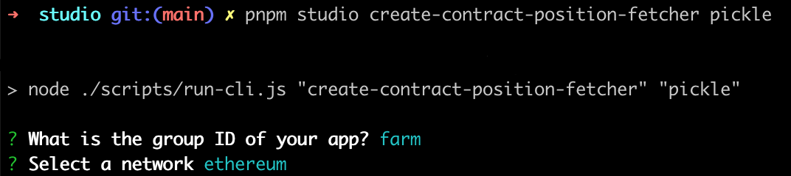

# Create a contract position fetcher

In the Zapper API, a `ContractpositionFetcher` class dynamically lists a single
group of `ContractPosition` typed objects. You can see more information
[here](../concepts/contract-positions.md).

## Generate a contract position fetcher

Our codegen utilities will automatically generate the boilerplate for a contract
position fetcher. Run `pnpm studio create-contract-position-fetcher pickle`.
When prompted for the group, select `farm`, and when prompted for the network,
select `ethereum`.



## Implement the contract position fetcher

Let's open `src/apps/pickle/ethereum/pickle.farm.contract-position-fetcher.ts`.
The skeleton has been assembled for you to implement the properties described in
[here](../concepts/contract-positions.md). Your job is to correctly implement
the scaffolded abstract properties and methods (and possibly override some
default functionality from the parent class as well)

```ts
import { Inject } from "@nestjs/common";
import { BigNumberish, Contract } from "ethers";

import { APP_TOOLKIT, IAppToolkit } from "~app-toolkit/app-toolkit.interface";
import { PositionTemplate } from "~app-toolkit/decorators/position-template.decorator";
import { DefaultDataProps } from "~position/display.interface";
import { ContractPositionTemplatePositionFetcher } from "~position/template/contract-position.template.position-fetcher";
import {
  GetDefinitionsParams,
  DefaultContractPositionDefinition,
  GetTokenDefinitionsParams,
  UnderlyingTokenDefinition,
  GetDisplayPropsParams,
  GetTokenBalancesParams,
} from "~position/template/contract-position.template.types";

import { PickleContractFactory } from "../contracts";

@PositionTemplate()
export class EthereumPickleFarmContractPositionFetcher extends ContractPositionTemplatePositionFetcher<Contract> {
  groupLabel: string;

  constructor(
    @Inject(APP_TOOLKIT) protected readonly appToolkit: IAppToolkit,
    @Inject(PickleContractFactory)
    protected readonly pickleContractFactory: PickleContractFactory
  ) {
    super(appToolkit);
  }

  getContract(_address: string): Contract {
    throw new Error("Method not implemented.");
  }

  getDefinitions(
    _params: GetDefinitionsParams
  ): Promise<DefaultContractPositionDefinition[]> {
    throw new Error("Method not implemented.");
  }

  getTokenDefinitions(
    _params: GetTokenDefinitionsParams<
      Contract,
      DefaultContractPositionDefinition
    >
  ): Promise<UnderlyingTokenDefinition[] | null> {
    throw new Error("Method not implemented.");
  }

  getLabel(
    _params: GetDisplayPropsParams<
      Contract,
      DefaultDataProps,
      DefaultContractPositionDefinition
    >
  ): Promise<string> {
    throw new Error("Method not implemented.");
  }

  getTokenBalancesPerPosition(
    _params: GetTokenBalancesParams<Contract, DefaultDataProps>
  ): Promise<BigNumberish[]> {
    throw new Error("Method not implemented.");
  }
}
```

We'll note that our class is decorated with `@PositionTemplate()`. This
decorator populates the `appId`, `groupId`, and `network` properties at runtime
from the a conventional filepath structure as follows:
`src/apps/<app_id>/<network>/<app_id>.<group_id>.contract-position-fetcher.ts`.

We'll also note that the `AppToolkit` and `PickleContractFactory` have already
been injected into the scope of your class. What are these? The `AppToolkit`
provides an SDK of utilities to interact with the blockchain, retrieve base
token prices, or even retrieve tokens and positions from other apps defined in
Zapper. The `PickleContractFactory`, as explained in the previous section,
builds typed instances of the contract ABIs you have in your
`src/pickle/contracts/abis` directory.

Let's get to work!

## Implement `getContract`

Before we continue, what is a _farm_? A **farm** is a smart contract in which a
user can _stake_ their token in return for rewards over time. It incentivizes
the user to maintain their position in return for rewards. In the case of
Pickle, the user would receive **PICKLE** token rewards for staking their jar
tokens.

From the previous section, you should have already generated the contract
factory boilerplate code to create an instance of the `PickleGauge` typed Ethers
contract instance.

We know that all Pickle gauge farms implement this interface, so we'll replace
`Contract` in the `ContractPositionTemplatePositionFetcher` generic with
`PickleGauge`.

```ts
export class EthereumPickleFarmContractPositionFetcher extends ContractPositionTemplatePositionFetcher<PickleGauge> {
  // ...
}
```

Next, we'll implement `getContract` by calling the appropriate factory method on
our injected contract factory. Note that `address` represents the address of one
of the Pickle Jar tokens.

```ts
export class EthereumPickleFarmContractPositionFetcher extends ContractPositionTemplatePositionFetcher<PickleGauge> {
  //...

  getContract(address: string): PickleGauge {
    return this.contractFactory.pickleGauge({ address, network: this.network });
  }

  //...
}
```

## Implement `getDefinitions`

Pickle provides an
[API endpoint](https://api.pickle.finance/prod/protocol/pools) that lists out
all of the farm addresses across all supported networks on the Pickle
application.

We'll make use of this endpoint to list out all of our farms.

```ts
// Define a partial of the return type from the Pickle API
export type PickleVaultDetails = {
  gaugeAddress: string;
  network: string;
  apy: number;
};

export class EthereumPickleJarTokenFetcher extends AppTokenTemplatePositionFetcher<PickleJar> {
  //...

  async getDefinitions() {
    // Retrieve pool addresses from the Pickle API
    const endpoint = "https://api.pickle.finance/prod/protocol/pools";
    const response = await axios.get<PickleVaultDetails[]>(endpoint);
    const ethData = response.data.filter(({ network }) => network === "eth");
    const gaugeAddresses = ethData.map(({ gaugeAddress }) => gaugeAddress);
    return gaugeAddresses.map((address) => ({ address }));
  }

  //...
}
```

## Implement `getTokenDefinitions`

Our farm definitions have the staked token addresses and reward token addresses.
Let's resolve these as part of the `getTokenDefinitions` response, and augment
them with **metatype** to indicate which token is `supplied` and which token is
`claimable`.

```ts
export class EthereumPickleJarTokenFetcher extends AppTokenTemplatePositionFetcher<PickleJar> {
  //...

  async getTokenDefinitions({
    contract,
  }: GetTokenDefinitionsParams<PickleJar>) {
    return [
      {
        metaType: MetaType.SUPPLIED,
        address: await contract.TOKEN(),
        network: this.network,
      },
      {
        metaType: MetaType.CLAIMABLE,
        address: await contract.PICKLE(),
        network: this.network,
      },
    ];
  }

  //...
}
```

## Implement `getLabel`

We'll want to resolve a meaningful label for this position. Like stated in the
previous section for the `TokenFetcher` class, these labels are used to optimize
human readability of this investment.

```ts
export class EthereumPickleJarTokenFetcher extends AppTokenTemplatePositionFetcher<PickleJar> {
  //...

  async getLabel({ contractPosition }: GetDisplayPropsParams<PickleJar>) {
    return `Staked ${getLabelFromToken(contractPosition.tokens[0])}`;
  }

  //...
}
```

## Implement `getTokenBalancesPerPosition`

We need to describe what RPC methods to call to derive balances for each
position. We can do so by implementing the `getTokenBalancesPerPosition`. The
balances for each of the tokens described in `getTokenDefinitions` must be
returned from this function in the same order.

```ts
export class EthereumPickleJarTokenFetcher extends AppTokenTemplatePositionFetcher<PickleJar> {
  //...

  getTokenBalancesPerPosition({
    address,
    contractPosition,
  }: GetTokenBalancesParams<PickleJar>) {
    return [await contract.balanceOf(address), await contract.earned(address)];
  }

  //...
}
```

We're done! Visit
`http://localhost:5001/apps/pickle/positions?groupIds[]=farm&network=ethereum`
again in your browser and you can admire your completed work.

You can also now compute balances for a user by accessing
`http://localhost:5001/apps/pickle/balances?addresses=<ADDR>&network=ethereum`

This implementation works well, but it is a little naive. We have common
template classes to simplify building single staking farm positions. Abstract
templates make implementations easier and more consistent. You can see how a
helper could be used for a farm in [Recipes](../recipes/intro.md).
