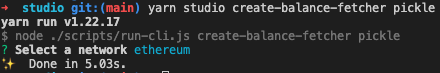

# Create a balance fetcher

## What is a balance?

A **balance** is a non-zero investment position held by a wallet address in a given app.

For example, perhaps `joe.eth` has is holding some Pickle 3Crv jar tokens, and has staked some Pickle Uniswap V2 LOOKS / ETH jar tokens. Our friend `joe.eth` has **two** balances in the Pickle app.

We know how to enumerate these positions from the previous two sections, but how do we show `joe.eth` his positions?

Easy! We'll build a `BalanceFetcher` that will give Pickle balances for any address.

## What is a balance fetcher?

In the Zapper API, a `BalanceFetcher` class returns balances for the tokens and contract positions (indexed from `TokenFetcher` and `ContractPositionFetcher` classes) of an application.

## Generate a contract position fetcher

Our codegen utilities will automatically generate the boilerplate for a balance fetcher. Run `pnpm studio create-balance-fetcher pickle`. When prompted for the network, select `ethereum`.



## Implement the balance fetcher

Let's open `src/apps/pickle/ethereum/pickle.balance-fetcher.ts`. The skeleton has been assembled for you, and you'll need to fill in the contents of the `getBalances` method in the `EthereumPickleBalanceFetcher` class.

```ts
import { Inject } from '@nestjs/common';

import { IAppToolkit, APP_TOOLKIT } from '~app-toolkit/app-toolkit.interface';
import { Register } from '~app-toolkit/decorators';
import { presentBalanceFetcherResponse } from '~app-toolkit/helpers/presentation/balance-fetcher-response.present';
import { BalanceFetcher } from '~balance/balance-fetcher.interface';
import { Network } from '~types/network.interface';

import { PICKLE_DEFINITION } from '../pickle.definition';

const network = Network.ETHEREUM_MAINNET;

@Register.BalanceFetcher(PICKLE_DEFINITION.id, network)
export class EthereumPickleBalanceFetcher implements BalanceFetcher {
  constructor(@Inject(APP_TOOLKIT) private readonly appToolkit: IAppToolkit) {}

  async getBalances(_address: string) {
    return presentBalanceFetcherResponse([]);
  }
}
```

Again, quite similar to the `TokenFetcher` and `ContractPositionFetcher`, except in this case, our stub method `getBalances` also takes an `address` as a parameter.

Let's get to work!

## Resolve jar token balances

We'll use a helper provided on the scope of our `AppToolkit` to resolve jar token balances. In a nutshell, it will simply iterate over all jar tokens, and call the `balanceOf` method on the provided address, returning a list of `AppTokenBalance` objects.

We'll return this as part of our response, and label this set of balances as `Jars`. This label is used by our mobile and frontend clients to categorize balances by sections.

```ts
// ...

@Register.BalanceFetcher(PICKLE_DEFINITION.id, network)
export class EthereumPickleBalanceFetcher implements BalanceFetcher {
  constructor(@Inject(APP_TOOLKIT) private readonly appToolkit: IAppToolkit) {}

  async getJarTokenBalances(address: string) {
    return this.appToolkit.helpers.tokenBalanceHelper.getTokenBalances({
      address,
      appId: PICKLE_DEFINITION.id,
      groupId: PICKLE_DEFINITION.groups.jar.id,
      network: Network.ETHEREUM_MAINNET,
    });
  }

  async getBalances(address: string) {
    const [jarTokenBalances] = await Promise.all([this.getJarTokenBalances(address)]);

    return presentBalanceFetcherResponse([
      {
        label: 'Jars',
        assets: jarTokenBalances,
      },
    ]);
  }
}
```

Find an address holding a Pickle vault token (hint: use Etherscan's **Holders** tab in the token view) and open `http://localhost:5001/apps/pickle/balances?addresses[]=<ADDRESS>&network=ethereum` in your browser.

## Resolve farm position balances

Contract position balances are a little more complicated than token balances. There's no standard way to resolve the underlying balances, so we'll use the `ContractPositionBalanceHelper` and implement a strategy to resolve the farm balances.

```ts
// ...

@Register.BalanceFetcher(PICKLE_DEFINITION.id, network)
export class EthereumPickleBalanceFetcher implements BalanceFetcher {
  // ...

  async getFarmBalances(address: string) {
    return this.appToolkit.helpers.contractPositionBalanceHelper.getContractPositionBalances({
      address,
      appId: PICKLE_DEFINITION.id,
      groupId: PICKLE_DEFINITION.groups.jar.id,
      network: Network.ETHEREUM_MAINNET,
      resolveBalances: async ({ address, contractPosition, multicall }) => {
        // Resolve the staked token and reward token from the contract position object
        const stakedToken = contractPosition.tokens.find(isSupplied)!;
        const rewardToken = contractPosition.tokens.find(isClaimable)!;

        // Instantiate an Ethers contract instance
        const contract = this.pickleContractFactory.pickleGauge(contractPosition);

        // Resolve the requested address' staked balance and earned balance
        const [stakedBalanceRaw, rewardBalanceRaw] = await Promise.all([
          multicall.wrap(contract).balanceOf(address),
          multicall.wrap(contract).earned(address),
        ]);

        // Drill the balance into the token object. Drill will push the balance into the token tree,
        // thereby showing the user's exposure to underlying tokens of the jar token!
        return [
          drillBalance(stakedToken, stakedBalanceRaw.toString()),
          drillBalance(rewardToken, rewardBalanceRaw.toString()),
        ];
      },
    });
  }

  async getBalances(address: string) {
    const [jarTokenBalances, farmBalances] = await Promise.all([
      this.getJarTokenBalances(address),
      this.getFarmBalances(address)
    ]);

    return presentBalanceFetcherResponse([
      {
        label: 'Jars',
        assets: jarTokenBalances,
      },
      {
        label: 'Farms',
        assets: farmBalances,
      },
    ]);
  }
}
```

Find an address with an open Pickle farm position (hint: use Etherscan's **Transactions** tab in the contract view) and open `http://localhost:5001/apps/pickle/balances?addresses[]=<ADDRESS>&network=ethereum` in your browser.

Voila! We have officially set up the fetchers that are neeeded to get our app's investments and balances in Zapper. You can continue to grow your app integration by implementing other networks, or supporting new tokens or farm types, but you are now armed with the tools to do so.

Remember that if you intend to add new NestJS providers to your application, you'll need to continue to add them to the `providers` in your module file. This step was done for you previously by the code generator.

Let's submit our PR!